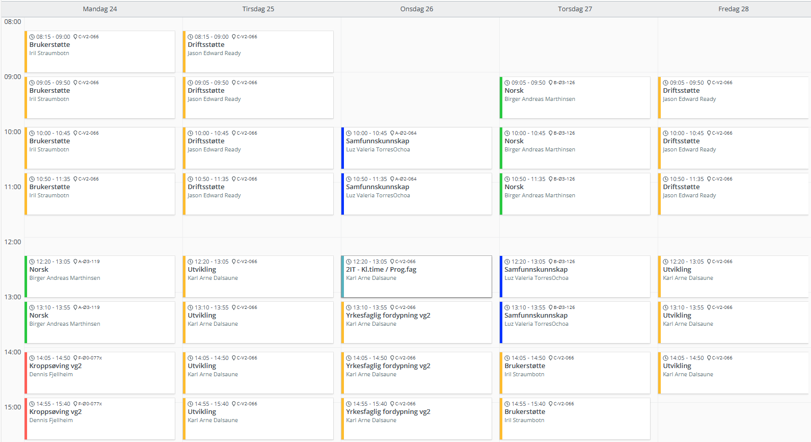

<!-- _class: lead -->
# Velkommen til 2IT

---

<!-- paginate: false -->

<!-- _class: lead -->
# Timeplan

---

# Første skoleuke

- Tirsdag: Skolestart
- Onsdag: Vanlig timeplan
- Torsdag: Tur til Estenstadhytta
- Fredag: Vanlig timeplan; bokutlevering kl 13:45

---

# ~~Tur til Estenstadhytta torsdag~~
# Aktivitetsdag på skolen torsdag

**Oppmøte**: Kl 10:00 i Ringve auditorium

Diverse sosiale aktiviteter på skolen. Vi steker vafler til lunsj.

Ferdig kl 14:00.

---

# Skaperfest 28.-29. august 

2MP & 2IT skal representere IM på Trondheim Skaperfest som et rekrutteringstiltak til linja.  

Fredag 28. august er det åpent for skolebesøk, lørdag 29. for alle.  

**Vi trenger elever til å stå på stand og representere IM fredag *og* lørdag!**
(Elever som deltar lørdag får avspasering)

Hele IT og MP skal være med å planlegge/rigge/rydde.

---

<!-- _class: lead -->
# Fraværsregler, 10%-grensen og dokumentert fravær

---

# Fraværsregler

#### Dokumentert fravær, telles _ikke_ mot 10%-regelen (nytt fra 2026)
- time hos lege, psykolog, fysioterapeut, tannlege
- innleggelse på sykehus
- kronisk sykdom
- avtalt besøk hos elevtjenesten (rådgiver, helsesykepleier)

(de tre første føres på vitnemålet)

---

# Fraværsregler

#### Dokumentert fravær, telles _ikke_ mot 10%-regelen 
- velferdsforhold
- andre religiøse høytidsdager enn de offentlige helligdagene (avgrenset til to dager)
- lovpålagt oppmøte
- arbeid som tillitsvalgt politisk arbeid hjelpearbeid 
- trygghetskurs på bane, andre og tredje del av trygghetskurs på vei og førerprøve for klasse B
- representasjon på arrangement på nasjonalt og internasjonalt nivå

---

# Hva er "velferdsforhold"?

> Fravær som skyldes «velferdsforhold» omfatter fravær på grunn av omsorgsoppgaver og familiære årsaker. Det kan for eksempel være fravær på grunn av omsorg for egne barn, eller fravær på grunn av begravelse eller alvorlig sykdom i familien. Deltakelse i en konfirmasjon kan også være en velferdsgrunn. 

[Udir: Rundskriv om fraværsgrensen](https://www.udir.no/regelverk-og-tilsyn/skole-og-opplaring/rundskriv-om-fravarsgrensen/3.-hva-omfattes-av-fravarsgrensen#3.1-alt-fravar-skal-telle-med)

---

# Fraværsregler

#### Sykdom
- Sykdom dokumenteres med egenmelding når du har under 10% fravær i faget
- Hvis du har (nesten) 10% fravær i et fag må sykdom dokumenteres med legeerklæring

**Du må alltid gi beskjed ved fravær, ellers kan du få nedsatt orden (ikke meldt fravær regnes som anmerkning)**

Fravær meldes i InSchool.